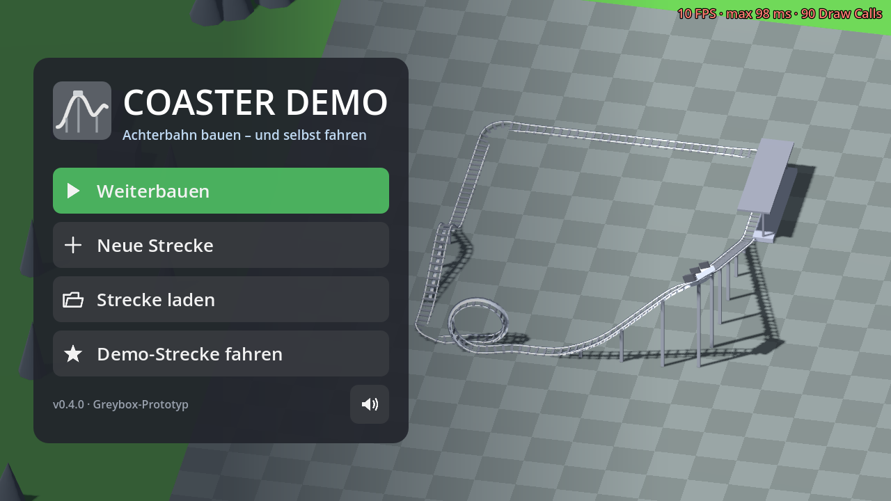
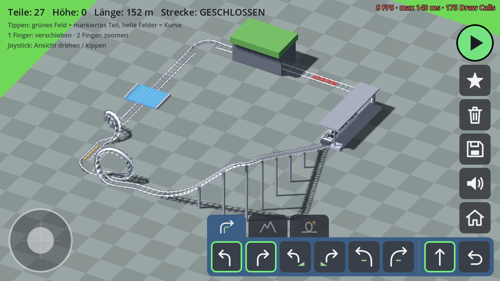
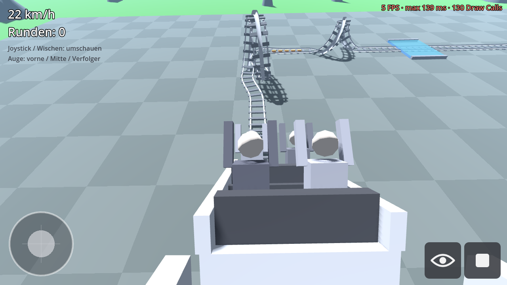
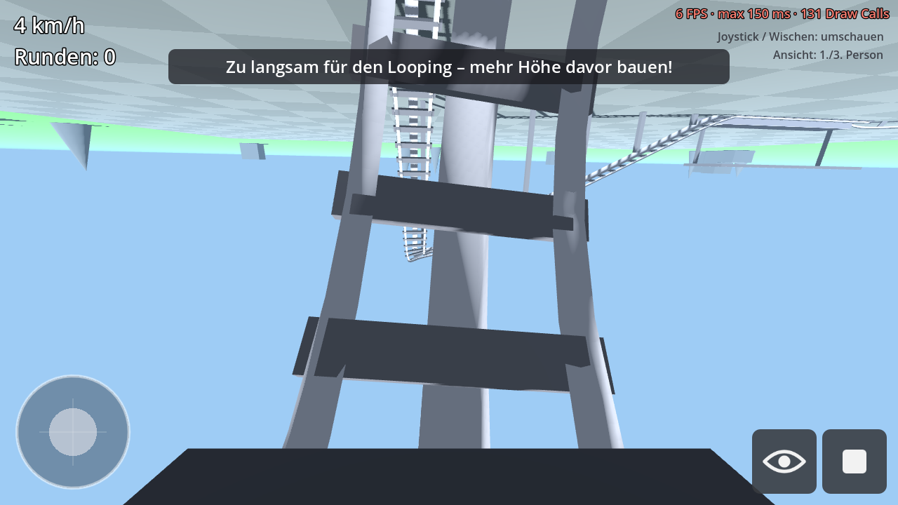
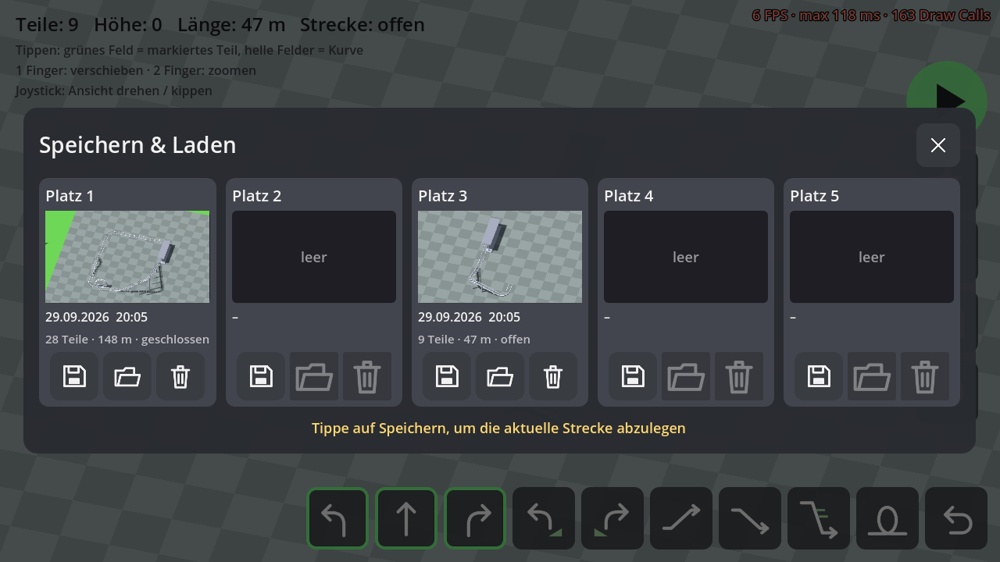

# Coaster Demo (Godot 4.3, Android arm64)

Greybox-Prototyp: Achterbahn in isometrischer Ansicht bauen und anschließend
selbst mitfahren. Alles besteht aus grauen Platzhalter-Formen – die richtigen
Grafik-Assets kommen später.



| Bauen | Fahren | Looping |
|---|---|---|
|  |  |  |

## Startbildschirm

Beim Start fährt im Hintergrund die Demo-Strecke, während die Kamera langsam
kreist. Menü: **Weiterbauen** (zuletzt bearbeitete Strecke, wird automatisch
gesichert), **Neue Strecke**, **Strecke laden** (öffnet die Speicherplätze),
**Demo-Strecke fahren**, dazu Ton an/aus. Im Spiel führt das Haus-Symbol – oder
die Android-Zurück-Taste – zurück zum Startbildschirm. Die Zurück-Taste schließt
vorher offene Menüs bzw. beendet eine laufende Fahrt; auf dem Startbildschirm
beendet sie die App.

## Steuerung

**Baumodus**

| Geste | Wirkung |
|---|---|
| Tippen auf das **grüne Feld** (bzw. das Feld davor) | Das grün markierte Geradeaus-Teil setzen (Gerade / Hoch / Runter / Steil / Looping) |
| Tippen auf ein **helles Seitenfeld** | Kurve links / rechts (flach oder geneigt – je nachdem, welche markiert ist) |
| 1 Finger ziehen | Ansicht verschieben |
| 2 Finger (Pinch) | Zoomen |
| Joystick (unten links) | Links/rechts: Ansicht drehen · hoch/runter: Blickwinkel kippen |
| Icon-Leiste unten | Kurve links, Gerade, Kurve rechts, Schrägkurve links/rechts, Hoch, Runter, Steile Abfahrt, Looping, Zurück |
| Rechts | ▶ Fahren, ★ Demo-Strecke, 🗑 Neue Strecke, 💾 Speichern & Laden, 🔊 Ton an/aus, 🏠 Startbildschirm |

Die Strecke startet an der Station. Führt man sie in Fahrtrichtung zurück in
die Station, ist sie **geschlossen** und der Wagen fährt endlos Runden. Offene
Strecken können auch getestet werden – die Fahrt endet dann am letzten Teil.
Kreuzungen sind erlaubt, wenn mindestens eine Höhenstufe Abstand dazwischen ist.

| Teil | Wirkung |
|---|---|
| Schrägkurve | 90°-Kurve, 35° zur Innenseite geneigt (Neigung wird weich ein-/ausgeblendet) |
| Steile Abfahrt | 2 Höhenstufen (4 m) auf einer Zelle, ca. 45° |
| Looping | 2 Zellen lang, Radius 2,6 m, Ein- und Ausfahrt seitlich versetzt; braucht ca. 41 km/h bei der Einfahrt (sonst Hinweis „zu langsam“) |

## Speichern & Laden

Das Disketten-Symbol öffnet das Menü mit **5 Speicherplätzen**. Jeder Platz zeigt
ein Vorschaubild der Strecke, Datum und Uhrzeit der letzten Speicherung sowie
Teile, Länge und ob die Strecke geschlossen ist. Überschreiben und Löschen
müssen mit einem zweiten Tipp bestätigt werden. Gespeichert wird im
App-Datenverzeichnis (`user://slots/slot_N.json` + `slot_N.png`); die Strecke
wird dabei als Liste der Teiltypen abgelegt.



## Sounds

Bauen (Klacken, Fehler-Brummen, Zurück, Glockenspiel beim Schließen),
Speichern/Laden, Abfahrtsglocke, Rollgeräusch und Fahrtwind (Lautstärke und
Tonhöhe folgen dem Tempo), Kettenlift-Klackern auf „Hoch“-Teilen und Bremszischen
bei der Einfahrt in die Station. Alle Sounds sind synthetische Platzhalter aus
`tools/make_sounds.py` (`python3 tools/make_sounds.py`, braucht numpy) und können
durch echte Aufnahmen gleichen Namens in `sounds/` ersetzt werden.

Oben rechts steht die **Performance-Anzeige**: FPS (grün ≥ 55, gelb ≥ 30, rot darunter),
längster Frame der letzten halben Sekunde und Draw Calls.

**Fahrmodus**: Joystick oder Wischen zum Umschauen, *Ansicht* wechselt
zwischen 1. Person und Verfolgerkamera, *Stopp* zurück zum Bauen.

Auf dem Desktop: Linksklick = Tippen/Verschieben, Mausrad = Zoom,
rechte Maustaste ziehen = Drehen.

## Fahrphysik (vereinfacht)

- Hangabtrieb `a = -g · dy/ds`, dazu Luftwiderstand und Rollreibung
- „Hoch“-Teile haben einen Kettenlift (min. 3 m/s)
- Die Station bremst/beschleunigt auf 4 m/s
- Antriebsreifen verhindern Stillstand (min. 1 m/s)

## Projektstruktur

```
project.godot          Projekteinstellungen (GL Compatibility, Querformat)
main.tscn              Hauptszene (baut Welt/UI per Code auf)
scripts/main.gd        Welt, UI, Eingabe (Tap/Pinch/Pan), Fahrmodus
scripts/track.gd       Raster-Strecke, Pfad-Berechnung, Greybox-Meshes
scripts/iso_camera.gd  Isometrische Orthogonal-Kamera
scripts/joystick.gd    Virtueller Touch-Joystick
tests/smoke_test.gd    Headless-Test (Bauen, Tap, Schließen, Fahrt)
tests/screenshots.gd   Rendert Kontroll-Screenshots
icons/*.svg            Button-Icons (Platzhalter, leicht austauschbar)
sounds/*.wav           Soundeffekte (Platzhalter, *_loop.wav laufen als Schleife)
scripts/sfx.gd         Sound-Wiedergabe (Einzel-Sounds + tempoabhängige Fahrgeräusche)
scripts/save_slots.gd  Speicherplätze (JSON + Vorschaubild)
scripts/save_menu.gd   Speichern/Laden-Menü
scripts/title_screen.gd Startbildschirm
tools/make_sounds.py   Erzeugt die Platzhalter-Sounds
export_presets.cfg     Android-Export (nur arm64-v8a)
```

## Bauen & Testen

```bash
# Test (headless)
godot --headless --path coaster_demo -s res://tests/smoke_test.gd

# APK exportieren (Android-SDK + Debug-Keystore in den Editor-Einstellungen nötig)
godot --headless --path coaster_demo --export-debug "Android arm64" build/coaster_demo_arm64.apk
```

Der GitHub-Workflow `.github/workflows/coaster-android.yml` baut bei jedem
Push das APK und stellt es als Artefakt `coaster_demo_arm64` bereit.
Installation auf dem Handy: APK herunterladen, „Installation aus unbekannten
Quellen“ erlauben, öffnen.

## Nächste Schritte (Ideen)

- Echte Assets (Schienen, Wagen, Stützen, Umgebung) statt Greybox
- Mehr Teile: Booster, Korkenzieher, steile Auffahrten, größere Kurvenradien
- Mehrere Wagen, G-Kräfte-Anzeige, Strecken benennen/teilen
