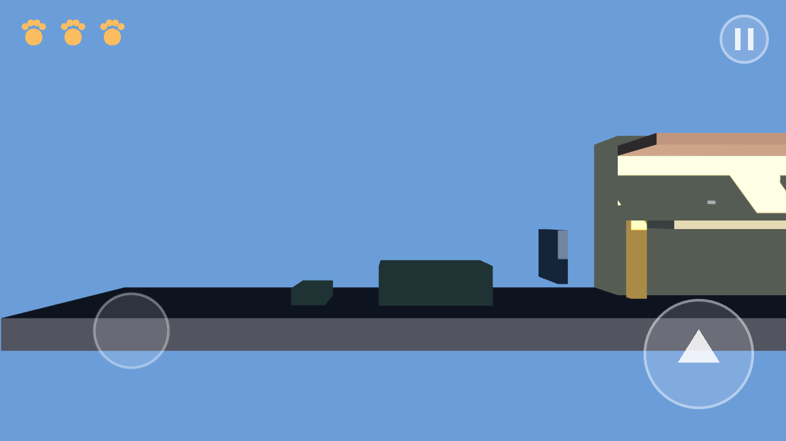

# Nachtkatze - Godot-Projekt

Stilisierter 2.5D-Plattformer nach dem Game Design Dokument 0.1.
Dieser Stand deckt **Meilenstein 1 (Bewegungsprototyp)** und
**Meilenstein 2 (Kernsysteme)** ab.

| | |
|---|---|
| Engine | Godot 4.3, Renderer "Mobile" |
| Hauptszene | `scenes/levels/level_greybox.tscn` |
| Zielplattform | Android, Querformat (Export folgt in Meilenstein 9) |



## Starten

1. Godot 4.3 oeffnen, Ordner `nachtkatze/` als Projekt importieren.
2. F5 druecken - das Graubox-Level startet.

Am Rechner laesst sich die Katze mit Pfeiltasten (laufen und klettern),
Leertaste (springen) und Escape (Pause) steuern. Auf dem Geraet gilt die
Touch-Steuerung aus dem GDD: Joystick links, Sprungtaste rechts, Pause oben
rechts. Greifen und Klettern brauchen keine eigene Taste.

## Was umgesetzt ist

**Meilenstein 1 - Bewegungsprototyp**

- Graubox-Level aus einem parametrischen Baustein (`GreyBlock`): Strasse,
  Fassaden, Balkone, Daecher, Zaun mit Luecke, geparktes Auto
- Katze als `CharacterBody3D` mit gesperrter Z-Achse
- Laufen, fester Sprung (keine variable Sprunghoehe), Klettern an markierten
  `Area3D`-Zonen, automatisches Festhalten an Kanten samt Hochziehen
- Kulanz fuer junge Spieler: 0,12 s Coyote-Zeit, 0,15 s Sprungpuffer
- Seitliche Verfolgerkamera mit fester Ausrichtung, Vorausschau und traeger
  Vertikale (Totzone 0,8 m)
- Touch-Steuerung mit echtem Mehrfinger-Betrieb (Joystick und Sprung
  gleichzeitig), zusaetzlich Tastatur fuer Tests

**Meilenstein 2 - Kernsysteme**

- 3 Lebenspunkte als gezeichnete Pfoten im HUD
- Futter: Fischgraete +1 LP, ganzer Fisch fuellt auf, Maximum wird nie
  ueberschritten
- Treffer: -1 LP, 1 s Unverwundbarkeit mit Blinken, Rueckstoss weg vom Gegner
- Bei 0 LP: Game-Over-Hinweis und automatischer Neustart des Levels
- Tutorial-Modus (`no_fail`): Lebenspunkte fallen nie unter 1
- Levelziel: Futternapf auf dem beleuchteten Balkon, danach Siegesanzeige
- Pausenmenue mit Weiter und Neustart
- Levelparameter als `LevelData`-Ressource (`resources/levels/`), damit
  Balancing ohne Codeaenderung moeglich ist

## Levelaufbau der Graubox

| Abschnitt | Inhalt |
|---|---|
| Strasse | Hindernis, geparktes Auto, Zaunluecke (fuer Hunde spaeter unpassierbar) |
| Fassade | Regenrinne auf Balkon 1, Sprung auf Balkon 2, zweite Rinne aufs Dach |
| Daecher | Dachluecken mit 1,5 m (leicht) und 3,2 m (schwer), untere Ausweichroute ueber Balkon und Markise |
| Finale | 6 m Kletterpassage, zwei Balkone, Futternapf auf 9 m Hoehe |


Futter liegt teils sicher (haelt den Fluss), teils neben einer Gefahr
(belohnt die mutige Route) - so wie es das GDD fuer die Risikosteuerung
vorsieht.

## Metriken

Alle Werte stammen aus Abschnitt 2 des GDD. Schwerkraft und Absprunggeschwindigkeit
werden im Code aus Sprunghoehe und Sprungweite abgeleitet, damit beide Metriken
exakt eingehalten werden:

| Wert | Umsetzung |
|---|---|
| Laufgeschwindigkeit | 4 m/s |
| Klettergeschwindigkeit | 2 m/s |
| Sprunghoehe | 1,8 m (gemessen 1,87 m inkl. Physikschritt) |
| Sprungweite aus dem Lauf | 3,5 m |
| Geschosshoehe | 3 m |
| Dachluecken | 1,5 m bis 3,2 m |

## Projektstruktur

```
scenes/    Spielszenen: Spielerin, Bausteine, Futter, HUD, Level
scripts/   GDScript nach Zustaendigkeit (player, world, items, ui, systems)
resources/ Levelparameter als .tres
tests/     Kopflose Funktionspruefung
tools/     Entwicklerwerkzeug fuer Bilder aus dem Level
```

## Tests

```
godot --headless --path nachtkatze --fixed-fps 60 res://tests/smoke_test.tscn
```

Prueft Metriken, Laufen, Sprunghoehe, alle Kletterzonen, Kantengriff, die
schwerste Dachluecke, Futter, Treffer mit Unverwundbarkeit, HUD, Levelziel,
Game Over und den Tutorial-Modus. Exit-Code 0 heisst alles gruen
(aktuell 38 Pruefungen). Die Meldung `Parameter "m" is null` im kopflosen
Betrieb kommt vom Dummy-Renderer und betrifft das Spiel nicht.

Bilder aus dem Level erzeugen:

```
xvfb-run godot --rendering-driver opengl3 --path nachtkatze \
  --resolution 1280x720 res://tools/screenshot.tscn
```

## Bewusste Vereinfachungen

- `Hazard` ist ein roter Platzhalterblock, nur damit Treffer und
  Unverwundbarkeit pruefbar sind. Die echten Gegner mit Zustandsautomaten und
  Warnsignalen (Hunde, Revierkatzen, Autos) sind Meilenstein 3.
- Die Grafik ist bewusst Graubox. Asset-Kit, Toon-Shader und Parallax-
  Hintergrund kommen in Meilenstein 5; die drei Tageszeiten sind als
  Lichtvoreinstellung schon angelegt und ueber `LevelData` umschaltbar.
- Start- und Hauptmenue, Levelauswahl und Speichern sind Meilenstein 6.
- Ton fehlt komplett (Meilenstein 7); die Audio-Busse kommen dort dazu.
- Ein Sturz aus grosser Hoehe kostet nichts - das GDD kennt keinen Fallschaden.
  Nur wer unter das Level faellt, verliert einen Lebenspunkt und setzt an der
  letzten sicheren Stelle wieder auf.

## Naechste Schritte

Meilenstein 3: Hunde, Revierkatzen und Autos als Zustandsautomaten mit
Warnzeit von 0,6 bis 0,8 s. `Hazard` wird dabei durch echte Gegnerszenen
ersetzt, die Trefferlogik der Katze bleibt unveraendert.
