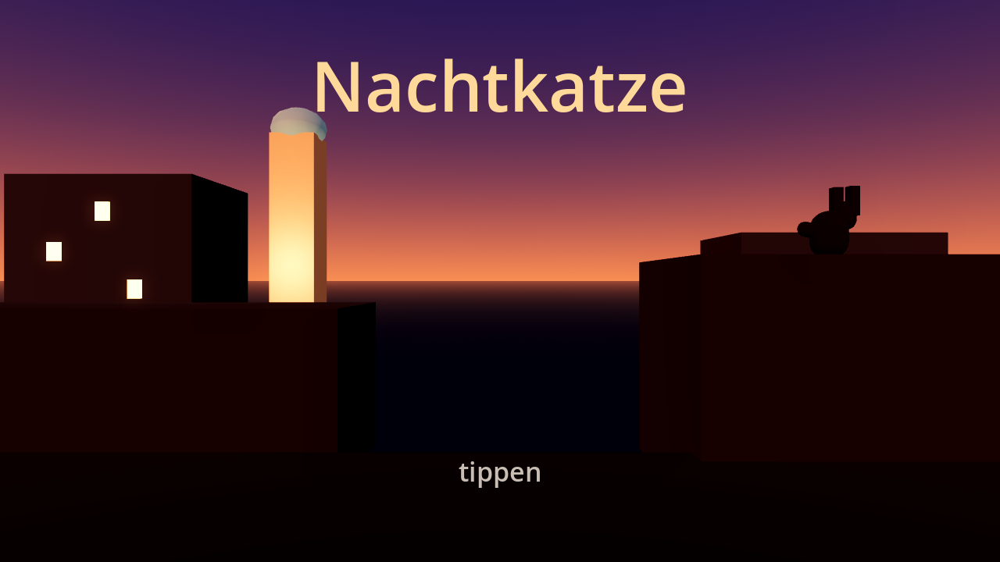
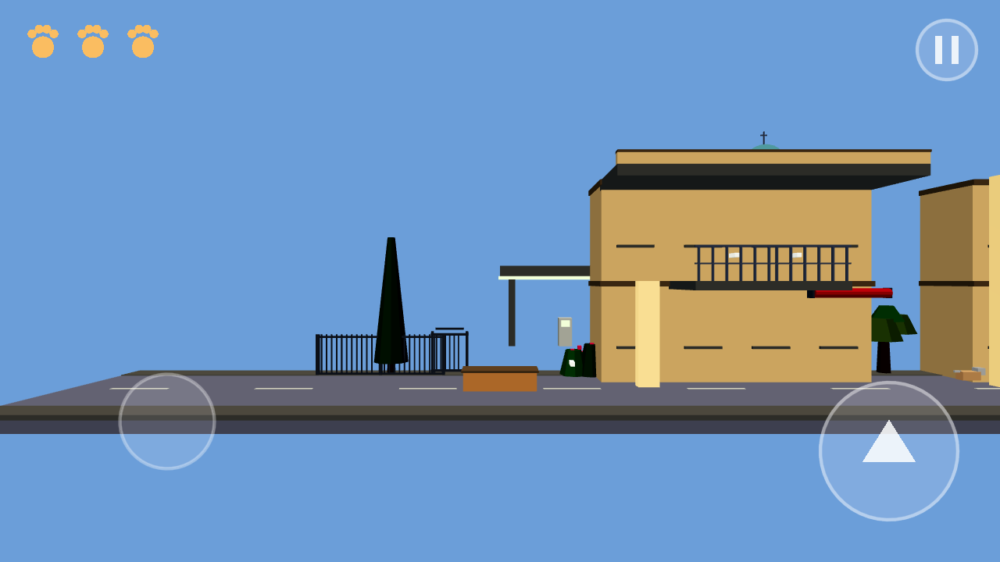
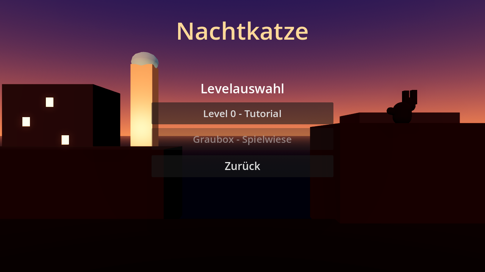
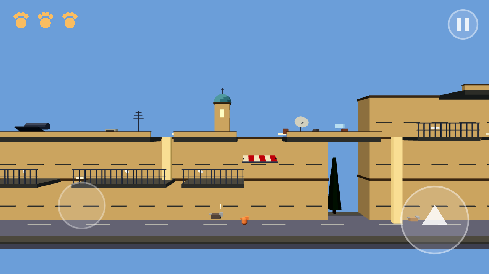
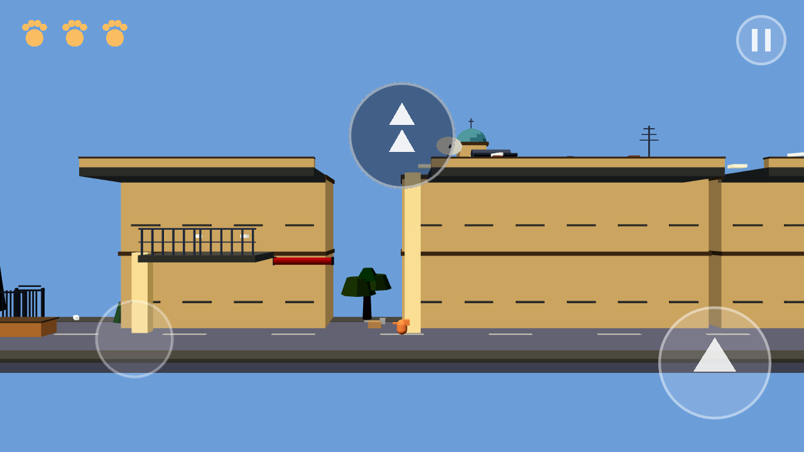
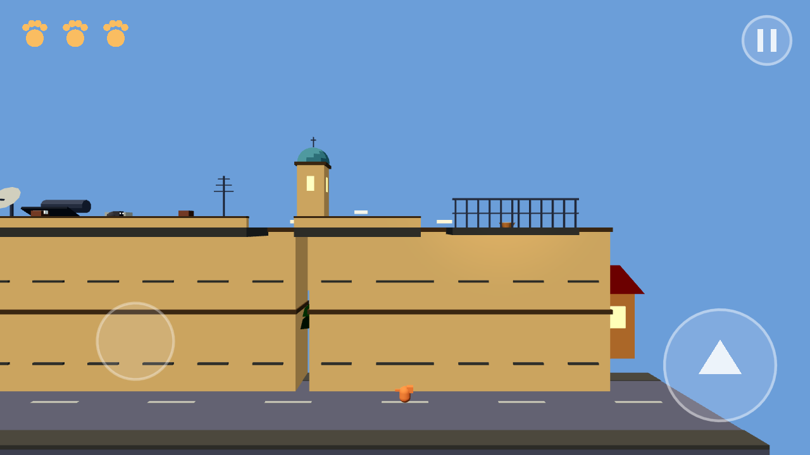
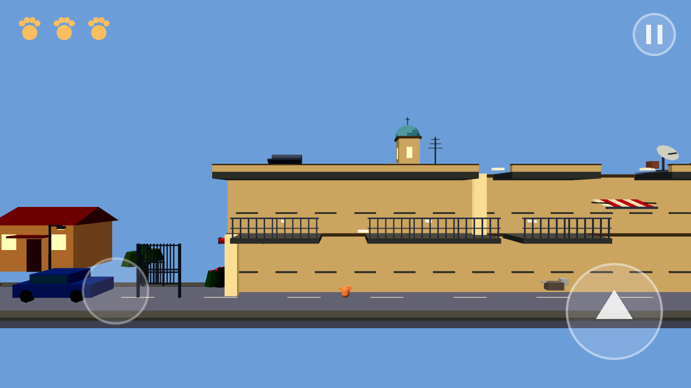
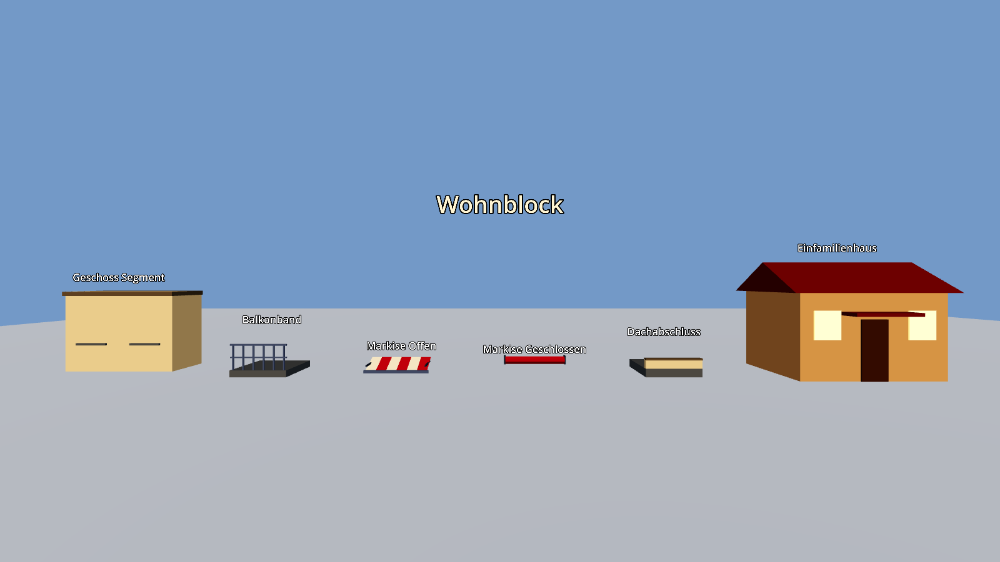
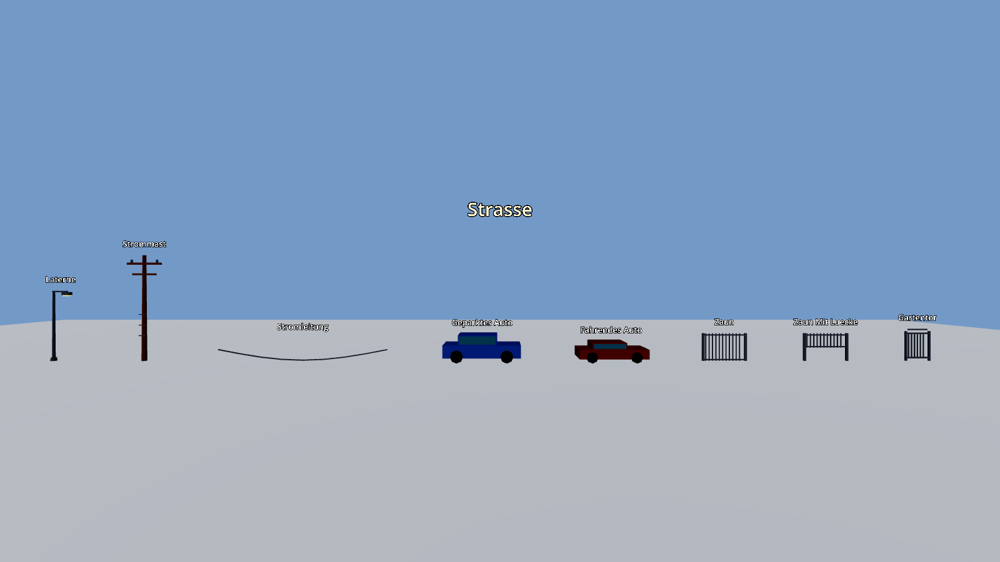
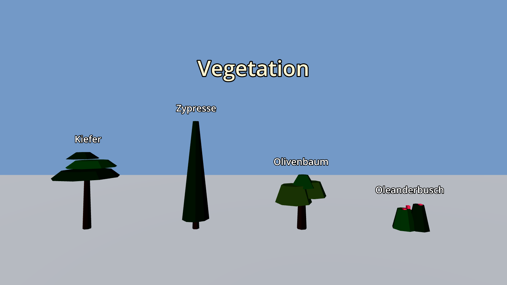

# Nachtkatze - Godot-Projekt

Stilisierter 2.5D-Plattformer nach dem Game Design Dokument 0.1.
Dieser Stand deckt **Meilenstein 1 bis 4 und 6** ab (Bewegungsprototyp,
Kernsysteme, Gegner, Tutorial, Startbild, Menues und Speichern) und aus
**Meilenstein 5** das Asset-Kit samt Toon-Shader - beide Levels sind
daraus gebaut. Offen bleibt aus Meilenstein 5 der Parallax-Hintergrund.

| | |
|---|---|
| Engine | Godot 4.3, Renderer "Mobile" |
| Hauptszene | `scenes/ui/title_screen.tscn` |
| Zielplattform | Android, Querformat (Export folgt in Meilenstein 9) |



Startbild in der Daemmerung: die Katze als Silhouette auf dem Dach, dahinter
der angestrahlte Kirchturm. Antippen fuehrt ins Hauptmenue.



So sieht es durch die Spielkamera aus: Pfoten oben links, Pause oben rechts,
Joystick unten links, Sprungtaste unten rechts. In der Mitte das Symbol des
Tutorials - Erklaerungen laufen ohne ein einziges Wort.

## Starten

1. Godot 4.3 oeffnen, Ordner `nachtkatze/` als Projekt importieren.
2. F5 druecken - es startet das Startbild, danach Hauptmenue, Tutorial und
   als zweites Level die Graubox-Spielwiese.

Am Rechner laesst sich die Katze mit Pfeiltasten (laufen und klettern),
Leertaste (springen) und Escape (Pause) steuern. Auf dem Geraet gilt die
Touch-Steuerung aus dem GDD: Joystick links, Sprungtaste rechts, Pause oben
rechts. Greifen und Klettern brauchen keine eigene Taste.

## Was umgesetzt ist

**Meilenstein 1 - Bewegungsprototyp**

- Graubox-Level aus einem parametrischen Baustein (`GreyBlock`): Strasse,
  Fassaden, Balkone, Daecher, Zaun mit Luecke, geparktes Auto
- Katze als `CharacterBody3D` mit gesperrter Z-Achse
- Laufen, fester Sprung (keine variable Sprunghoehe), Klettern an markierten
  `Area3D`-Zonen, automatisches Festhalten an Kanten samt Hochziehen
- Kulanz fuer junge Spieler: 0,12 s Coyote-Zeit, 0,15 s Sprungpuffer
- Seitliche Verfolgerkamera mit fester Ausrichtung, Vorausschau und traeger
  Vertikale (Totzone 0,8 m)
- Touch-Steuerung mit echtem Mehrfinger-Betrieb (Joystick und Sprung
  gleichzeitig), zusaetzlich Tastatur fuer Tests

**Meilenstein 2 - Kernsysteme**

- 3 Lebenspunkte als gezeichnete Pfoten im HUD
- Futter: Fischgraete +1 LP, ganzer Fisch fuellt auf, Maximum wird nie
  ueberschritten
- Treffer: -1 LP, 1 s Unverwundbarkeit mit Blinken, Rueckstoss weg vom Gegner
- Bei 0 LP: Game-Over-Hinweis und automatischer Neustart des Levels
- Tutorial-Modus (`no_fail`): Lebenspunkte fallen nie unter 1
- Levelziel: Futternapf auf dem beleuchteten Balkon, danach Siegesanzeige
- Pausenmenue mit Weiter und Neustart
- Levelparameter als `LevelData`-Ressource (`resources/levels/`), damit
  Balancing ohne Codeaenderung moeglich ist

**Meilenstein 3 - Gegner**

Jeder Angriff wird angekuendigt: waehrend der Warnzeit (0,7 s) steht der
Gegner still und zeigt ein Ausrufezeichen ueber dem Kopf. Ton kommt in
Meilenstein 7 dazu, bis dahin ist die Warnung rein sichtbar.

- **Kleiner Hund:** schnell, jagt in kurzen Sprints, kleiner Wahrnehmungsradius
- **Grosser Hund:** langsam, grosser Radius, breiterer Angriffsbereich
- Beide durchlaufen Ruhen, Patrouille, Warnung, Jagen, Rueckkehr. Sie klettern
  und springen nicht: ist die Katze auf der Fassade, bellen sie nach oben und
  kehren zur Patrouille zurueck. Zaunluecke (0,62 m) und geparkte Autos
  sperren sie schon durch ihre Groesse aus.
- **Revierkatze:** verteidigt nur ihr Dachgebiet, erkennbar an den
  Blumentoepfen an beiden Raendern. Sitzen, Revier-Patrouille, Warnung mit
  Buckel, Angriffssprung, Rueckzug. Verlaesst die Spielerkatze das Revier,
  zieht sie sich zurueck.
- **Fahrendes Auto:** kuendigt sich mit dem Scheinwerfer an, faehrt dann an
  der Katze vorbei. Treffer kostet einen Lebenspunkt mit Rueckstoss, kein
  Sofort-Aus. Es setzt sich jeweils ausserhalb des Bildes neu an, damit die
  Warnung auch sichtbar ist.
- **Passive Gegner** (Tutorial) warnen nur und tun der Katze nichts.

**Meilenstein 4 - Level 0 (Tutorial)**

Die Abfolge aus GDD Abschnitt 7, jede Mechanik einzeln und ohne Text:
Laufen, Sprung ueber ein niedriges Hindernis, Klettern an der Regenrinne auf
den ersten Balkon, Fischgraete fressen, schlafender Hund (wacht kurz auf und
bellt, tut aber nichts), Dach mit passiver Revierkatze, Sprung ueber eine
kleine Dachluecke von 1,5 m, Futternapf auf dem beleuchteten Balkon.
Scheitern ist ausgeschlossen: die Lebenspunkte fallen nie unter 1.

Erklaert wird ausschliesslich ueber gezeichnete Symbole - Joystick mit
Pfeilen, Sprungpfeil, Kletterpfeile, Pfote und Ausrufezeichen. Sie tauchen
auf, sobald die Katze den jeweiligen Bereich betritt.

**Meilenstein 6 - Benutzeroberflaeche**

- Startbild in der Daemmerung, Antippen fuehrt weiter
- Hauptmenue mit Spielen (setzt beim naechsten ungeloesten Level fort),
  Levelauswahl und Einstellungen
- Levelauswahl: Levels werden nacheinander freigeschaltet, geschaffte Levels
  sind mit einem Haken markiert
- Einstellungen: Musik und Sound getrennt schaltbar. Die Audio-Busse `Music`
  und `SFX` sind angelegt und werden schon stummgeschaltet; Toene kommen in
  Meilenstein 7 dazu.
- Pausenmenue mit Weiter, Neustart und Zurueck zum Menue; nach dem Sieg
  zusaetzlich eine Menue-Schaltflaeche
- Gespeichert wird per `ConfigFile` unter `user://nachtkatze.cfg`:
  geschaffte Levels und die beiden Tonschalter



**Balancing nach dem zweiten Spieltest**

- Kein Gegner erreicht mehr die Laufgeschwindigkeit der Katze (4 m/s):
  kleiner Hund 3,2 m/s in kurzen Sprints, grosser Hund 2,2 m/s,
  Revierkatze 1,6 m/s. Weglaufen funktioniert damit immer.
- Nach einem Treffer laesst der Gegner 1,5 s lang los und nimmt die Katze
  nicht wahr - sonst haette man am Boden mehrere Treffer hintereinander
  kassiert.
- Autos sind flach (0,68 m Schadenshoehe) und ihr Schadensbereich ist
  kuerzer als die Karosserie. Wer rechtzeitig springt, kommt sicher
  darueber: das Zeitfenster ist rund 0,3 s breit statt 0,1 s.

## Levels aus dem Kit

Beide Levels bestehen aus Modulen des Asset-Kits: Strassenstuecke zu 4 m,
Geschoss-Segmente zu 4 m, Balkone und Daecher zu 2 m. Die Bauteile werden
ueber `tiles` aneinandergereiht, Mesh und Kollision entstehen daraus
automatisch. Die spielrelevanten Masse sind dabei gleich geblieben: 3 m je
Geschoss, Dachluecken von 1,5 m und 3,2 m, dieselben Kletterhoehen.

Nur was die Katze traegt oder aufhaelt, hat Kollision. Balkongelaender,
Dachattika und alle Zierbauteile stehen ausserhalb der Spielebene oder sind
als `solid = false` gesetzt, damit sie den Weg nicht verstellen.



## Levelaufbau der Graubox (Spielwiese nach dem Tutorial)

| Abschnitt | Inhalt |
|---|---|
| Strasse | Hindernis, geparktes Auto, Zaunluecke (fuer Hunde spaeter unpassierbar) |
| Fassade | Regenrinne auf Balkon 1, Sprung auf Balkon 2, zweite Rinne aufs Dach |
| Daecher | Dachluecken mit 1,5 m (leicht) und 3,2 m (schwer), untere Ausweichroute ueber Balkon und Markise |
| Finale | 6 m Kletterpassage, zwei Balkone, Futternapf auf 9 m Hoehe |







Futter liegt teils sicher (haelt den Fluss), teils neben einer Gefahr
(belohnt die mutige Route) - so wie es das GDD fuer die Risikosteuerung
vorsieht.

## Metriken

Alle Werte stammen aus Abschnitt 2 des GDD. Schwerkraft und Absprunggeschwindigkeit
werden im Code aus Sprunghoehe und Sprungweite abgeleitet, damit beide Metriken
exakt eingehalten werden:

| Wert | Umsetzung |
|---|---|
| Laufgeschwindigkeit | 4 m/s |
| Klettergeschwindigkeit | 2 m/s |
| Sprunghoehe | 1,8 m (gemessen 1,87 m inkl. Physikschritt) |
| Sprungweite aus dem Lauf | 3,5 m |
| Geschosshoehe | 3 m |
| Dachluecken | 1,5 m bis 3,2 m |

## Projektstruktur

```
scenes/    Spielszenen: Spielerin, Bausteine, Futter, HUD, Level
scripts/   GDScript nach Zustaendigkeit (player, world, items, ui, systems,
           enemies, assets)
assets/    Toon-Shader und das gemeinsame Material
resources/ Levelparameter als .tres
tests/     Kopflose Funktionspruefung
tools/     Entwicklerwerkzeug fuer Bilder aus dem Level
```

## Tests

```
godot --headless --path nachtkatze --fixed-fps 60 res://tests/smoke_test.tscn
```

Prueft Metriken, Laufen, Sprunghoehe, Kameraverhalten beim Fallen, alle
Kletterzonen beider Levels, Kantengriff, die schwerste Dachluecke, Futter,
Treffer mit Unverwundbarkeit, die Zustandsautomaten von Hund, Revierkatze und
Auto, HUD, Levelziel, Game Over, das Tutorial, das Weglaufen vor Gegnern,
den Sprung ueber ein Auto samt Timing-Spielraum, Levelkatalog, Speicherstand,
die Menues und das Asset-Kit (darunter, ob die Normalen nach aussen zeigen).
Exit-Code 0 heisst alles gruen (aktuell 107 Pruefungen). Die Meldung `Parameter "m" is null` im kopflosen
Betrieb kommt vom Dummy-Renderer und betrifft das Spiel nicht.

## Android-APK bauen

Gebraucht werden Godot 4.3 (Editor-Binary), die Export-Templates 4.3.stable,
ein JDK und aus dem Android-SDK die Ordner `build-tools` (wegen `apksigner`)
und `platform-tools`. SDK-Pfad und Debug-Keystore stehen in den
Editor-Einstellungen (`export/android/android_sdk_path`,
`export/android/debug_keystore`). Das Preset liegt als
`export_presets.cfg` im Projekt.

```
godot --headless --path nachtkatze --export-debug "Android" ../build/nachtkatze-m2-debug.apk
```

Ergebnis: rund 24 MB, `org.nachtkatze.prototyp` in Version 0.4.0,
minSdk 21, targetSdk 34,
Querformat, Architektur arm64-v8a, signiert mit den Schemata v1, v2 und v3.
`armeabi-v7a` laesst sich im Preset zuschalten, kostet aber rund 22 MB. Das Spiel nutzt den Mobile-Renderer und braucht
daher Vulkan (auf Geraeten ab etwa 2016 vorhanden).

Bilder aus dem Level erzeugen:

```
xvfb-run godot --rendering-driver opengl3 --path nachtkatze \
  --resolution 1280x720 res://tools/screenshot.tscn
```

## Bewusste Vereinfachungen

- Gegner sind noch Graubox-Kisten ohne Animationen; die Zustandsautomaten und
  Warnzeiten stimmen aber schon. Animationen und Ton folgen in Meilenstein 5
  und 7.
- Die Grafik ist bewusst Graubox. Asset-Kit, Toon-Shader und Parallax-
  Hintergrund kommen in Meilenstein 5; die drei Tageszeiten sind als
  Lichtvoreinstellung schon angelegt und ueber `LevelData` umschaltbar.
- Start- und Hauptmenue, Levelauswahl und Speichern sind Meilenstein 6.
- Ton fehlt komplett (Meilenstein 7); die Audio-Busse kommen dort dazu.
- Die Levels rendern ohne Schlagschatten. Je nach Renderer beschattete sich
  die Katze selbst und wurde fast schwarz. Der Toon-Shader stuft stattdessen
  das Sonnenlicht; echte Schatten und LightmapGI sind spaeter dran.
- Spielerkatze und Gegner nutzen noch Standardmaterialien statt des
  Toon-Shaders - sie sollen sich klar von der Kulisse abheben.
- Ein Sturz aus grosser Hoehe kostet nichts - das GDD kennt keinen Fallschaden.
  Nur wer unter das Level faellt, verliert einen Lebenspunkt und setzt an der
  letzten sicheren Stelle wieder auf.

## Asset-Kit (GDD Abschnitt 8)

27 Bauteile, alle prozedural erzeugt - wie es GDD Abschnitt 15 vorsieht.
Es gibt keine Modelldateien und keine Texturen: `AssetKit` baut die Meshes
aus Kisten, Zylindern, Kegeln, Kuppeln und Prismen zusammen, jede Flaeche
mit eigener Normale, damit die Kanten hart bleiben.

| Gruppe | Bauteile |
|---|---|
| Wohnblock | Geschoss-Segment, Balkonband mit Metallgelaender, Markise offen und geschlossen, Dachabschluss |
| Einfamilienhaus | Haus mit rotem Ziegelvordach |
| Dach-Props | Solarkollektor mit Boiler, Satellitenschuessel, Antenne, Klimageraet |
| Strasse | Laterne, Strommast, Stromleitung, geparktes und fahrendes Auto, Zaun mit und ohne Luecke, Gartentor |
| Vegetation | Kiefer, Zypresse, Olivenbaum, Oleanderbusch |
| Landmarken | Kirchturm mit Kuppel, Tankstelle mit gruenem Leuchtband |
| Interaktiv | Fischgraete, ganzer Fisch, Futternapf |





### Farben und Shader

Statt Texturen traegt jeder Eckpunkt seine Farbe aus `Palette`; der
Alphakanal steuert, wie stark eine Flaeche leuchtet. Damit kommt das ganze
Kit mit einem einzigen Material aus - gut fuer die Batchverarbeitung auf
dem Geraet. Der Toon-Shader stuft das Sonnenlicht in drei harte Helligkeits-
stufen (GDD Abschnitt 9).

Zwei Dinge sind dabei wichtig zu wissen:

- Der Compatibility-Renderer unterstuetzt keine eigenen `light()`-Funktionen.
  Fuer ihn hat der Shader einen Ersatzpfad, den `AssetKit.configure_material()`
  automatisch einschaltet. Auf dem Geraet (Mobile-Renderer) laeuft der
  richtige Weg ueber `light()`.
- Beide Wege sind auf dieselbe Helligkeit geeicht: `light()` teilt durch PI
  wie Godots eingebautes Lambert, der Ersatzpfad rechnet mit 0,85.
  `Level._apply_time_of_day()` meldet Sonnenrichtung und -farbe je Tageszeit
  an den Ersatzpfad weiter.

### Verwenden

Im Level die Szene `scenes/world/asset_piece.tscn` instanzieren und `kind`
setzen - Mesh, Material und Kollision entstehen von selbst. Kollision gibt es
nur bei Teilen, auf denen die Katze stehen soll oder die sie aufhalten;
Pflanzen und Dach-Props sind reine Zier.

Alle Bauteile ansehen:

```
xvfb-run godot --rendering-driver opengl3 --path nachtkatze \
  --resolution 1600x900 res://tools/screenshot.tscn -- kit
```

## Naechste Schritte

Aus Meilenstein 5 fehlt noch der Parallax-Hintergrund. Danach
Meilenstein 7 (Ton) und Meilenstein 8 (Levels 1 bis 10).
